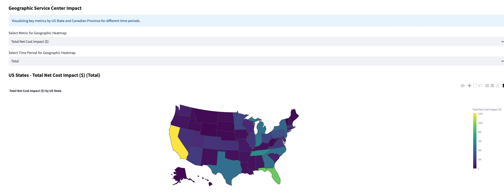
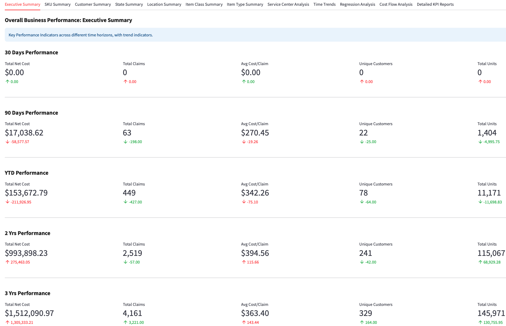
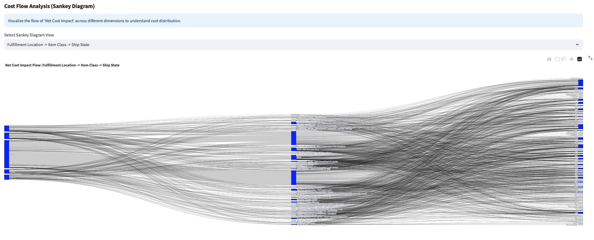

# Risk Optimization Console

Analytics platform for warranty and service operations — safety-stock modeling, custom cost KPI engineering, and cost-flow analysis built from raw ERP transaction data.

## Inventory Modeling
- Safety stock and reorder points across 1,400+ SKU-location combinations
- Demand and lead-time variance with service-level Z-score targets
- Multi-location inventory optimization
- Composite risk scoring with quartile-based service-level assignment

## Analytics
- Executive dashboards across 30-day, 90-day, YTD, 2-year, and 3-year windows with period-over-period deltas
- Cost-flow visualization via Sankey diagrams across four configurable dimension paths
- Geographic cost distribution across US states and Canadian provinces
- Automated KPI generation across eight dimensions: SKU, customer, location, state, month, customer category, item class, item type

## Data Processing
- Transaction normalization and derived-metric engineering (margin bleed, cost velocity, failure-distribution entropy)
- Outlier detection with 99th-percentile capping
- Threshold-based risk flagging and leaderboard ranking

## Screenshots

### Geographic Analysis
Cost distribution mapping across US states and Canadian provinces


### Executive Dashboard
Multi-timeframe performance monitoring with trend indicators


### Cost Flow Analysis
Sankey visualization of cost distribution across locations, products, and regions


## Technical Implementation
**Statistical methods** — demand forecasting, risk scoring via normalized distribution analysis, lead-time modeling with coefficient of variation

**Platform** — Python/pandas for processing and computation, Streamlit for the application layer, Plotly for visualization

**Integration** — ERP data pipeline with automated report and KPI generation

## Deployment
```bash
pip install streamlit pandas numpy plotly scikit-learn
streamlit run streamlit_app.py
```
Upload data → run analysis → navigate reporting interface
