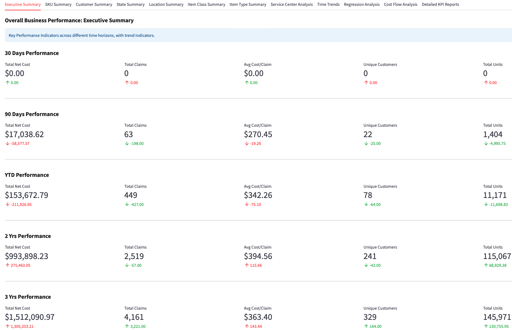
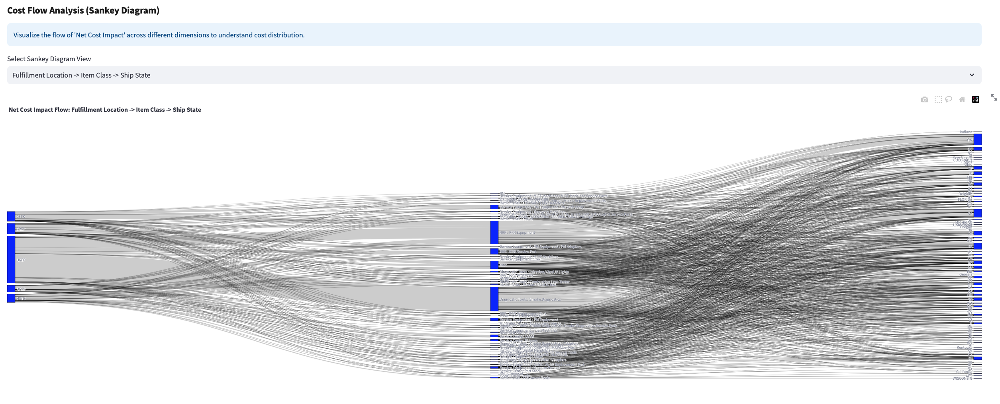
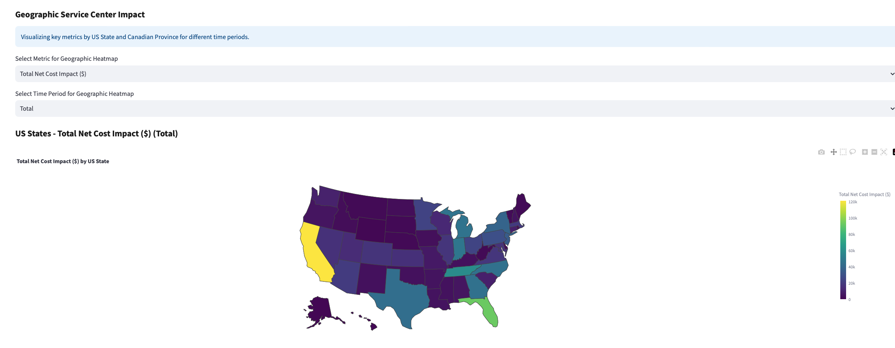

# Risk Optimization Console

Operations research platform for supply chain optimization using advanced statistical modeling.

## Mathematical Optimization
- Safety stock calculation with statistical risk modeling across 1,400+ SKU combinations
- Cost variance analysis with robust forecasting methods
- Multi-location inventory optimization with uncertainty modeling

## Analytics Platform
- Executive dashboards with multi-timeframe performance tracking
- Cost flow visualization through Sankey diagrams
- Geographic performance analysis across fulfillment networks
- Automated KPI generation across multiple business dimensions

## Data Processing
- Transaction data normalization and statistical analysis
- Outlier detection with 99th percentile capping
- Performance ranking and variance identification systems

## Visual Intelligence

### Executive Dashboard
Multi-timeframe performance monitoring with trend analysis and key metrics



### Cost Flow Analysis
Sankey visualization showing operational cost distribution across locations, products, and regions



### Geographic Analysis
Cost distribution mapping across US states and Canadian provinces



## Technical Implementation

**Statistical Methods** - Demand forecasting with uncertainty modeling, risk scoring using normalized distribution analysis, lead time optimization with coefficient of variation methods

**Platform** - Python/Pandas for data processing and statistical computation, Streamlit deployment with real-time analytics, Plotly visualization for executive reporting

**Integration** - ERP automation with JavaScript workflow tools, multi-system data connectivity and processing, automated report generation and KPI tracking

## Deployment

```bash
pip install streamlit pandas numpy plotly scikit-learn
streamlit run streamlit_app.py
```

Upload data → Run analysis → Navigate executive reporting interface

Statistical variance analysis for cost optimization identification. Automated processing pipeline with error detection and prevention. Multi-timeframe operational analysis with performance monitoring across enterprise supply chain networks.
